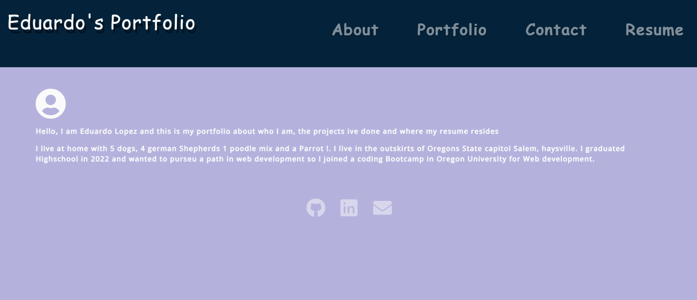

# React-Portfolio

## Description
- A portfolio about me and what my skills and recent projects are :D

## installion
- git clone the repo at https://github.com/Edesp1/React-Portfolio then run npm install and npm start back to back
- or view the deployed site at this link - https://portfolioreactvite.netlify.app 

## Usage

## collaborations
- further collaborations are closed until further notice thank you !

## license
- this project is under the MIT license

## badge
